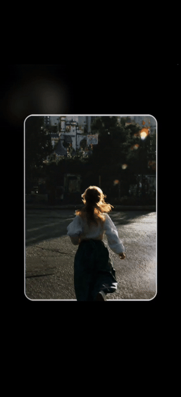

# Create Holographic Card

把一张图片或一句描述，做成可交互的 5:7 分层全息卡：生成原创卡面、分离背景与透明主体、用 WebGL2 预览材质效果，并按需导出到 React 或 [Cardex](https://github.com/Kutis5/Cardex)。

<p align="center">
  
</p>

> 从卡面到可倾斜、可扫光、可导出的全息卡片，安装一次即可完成。

## 快速开始

推荐安装完整插件 **Holographic Card Studio**。它会同时带来主 skill、预览 skill、本地 MCP 服务、WebGL renderer 和材质纹理。

```powershell
git clone https://github.com/Kutis5/create-holographic-card-skill.git
codex plugin marketplace add .\create-holographic-card-skill
```

在 Codex 的 Plugins 页面安装 **Holographic Card Studio** 后，新任务会自动拥有：

- `$create-holographic-card`
- `$preview-holographic-card`
- `preview_holographic_card` MCP 工具

## 直接使用

把已有照片制作成卡片：

```text
$create-holographic-card 把这张人物照片做成一张 5:7 分层全息卡，使用 pearl 材质和克制的淡银扫光。
```

从文字描述生成原创卡面：

```text
$create-holographic-card 根据“一只坐在月球温室里的灰猫”生成原创卡面，并制作完整分层预览。
```

导出到 [Cardex](https://github.com/Kutis5/Cardex)：

```text
$create-holographic-card 将这张完成的卡导出为 Cardex .hcard 收藏文件。
```

也可以直接描述想要的卡片。Codex 会在请求匹配时调用对应 skill。

## 这套工具做什么

| 阶段 | 结果 |
| --- | --- |
| 创建 | 接收现有图片，或由描述生成原创 5:7 卡面。 |
| 分层 | 产出背景层和全画布透明主体层，保持主体像素与位置。 |
| 材质 | 选择全息材质、箔片调色板、纹理、眩光和视差参数。 |
| 预览 | 在 Codex Browser 中打开一次真实 WebGL2 交互预览。 |
| 交付 | 输出验证结果、React 组件资产，或可导入 [Cardex](https://github.com/Kutis5/Cardex) 的 `.hcard`。 |

主体始终位于光学层之上：箔片、纹理、闪点和眩光只作用于背景与材质表面，透明主体仅参与视差和自然阴影。

## 材质会自己判断分寸

浅色、低饱和、粉彩和产品摄影默认使用淡银扫光：`foil 0.28`、`texture 0.32`、`glare 0.36`。它保留物体本身的颜色，不把浅色高光漂成彩虹。

高饱和、幻想虹彩，或明确要求彩虹的画面使用旗舰模式：`foil 0.78`、`texture 0.48`、`glare 0.62`。可选材质包括：

`clear-coat`、`pearl`、`brushed-metal`、`spectral-lines`、`etched-holo`、`cosmic-flake`、`star-holo`。

所有材质保持同一套 3D 深度规则：最大 `14deg x 14deg` 倾斜、`1.024` 悬浮缩放，以及独立的主体视差。

## 输出到你的项目

### React

适用于 Vite React 或 Next.js TypeScript 项目：

```bash
python scripts/install_component.py --project <project-path>
```

注册卡片资产：

```bash
python scripts/register_card.py \
  --project <project-path> \
  --slug <short-name> \
  --background <background.png> \
  --subject <subject.png> \
  --art-alt <description> \
  --presentation <presentation.json>
```

随后使用：

```tsx
<HolographicCard card={cardRegistry[cardId]} />
```

### [Cardex](https://github.com/Kutis5/Cardex)

将已验证的图层与 Presentation IR 打包为 `.hcard`：

```bash
python scripts/export_hcard.py \
  --card-dir <card-directory> \
  --id <stable-id> \
  --title <title> \
  --output <card.hcard>
```

[Cardex](https://github.com/Kutis5/Cardex) 是可选的 Android 收藏应用。生成和预览不依赖它；只有需要导出和收藏时才使用 `.hcard`。

## 独立安装与依赖

根目录仍提供 standalone skill，适合已有 MCP 配置的开发环境。它只包含核心工作流，不携带预览 MCP：

```text
$skill-installer install create-holographic-card from https://github.com/Kutis5/create-holographic-card-skill
```

本地图片处理需要 Python 3、Pillow 和 NumPy：

```bash
python -m pip install Pillow numpy
```

`rembg` 仅作为分层回退方案使用。工作流不会临时下载模型；需要该回退时，请自行安装并预缓存模型。

## 给开发者的说明

核心卡片工作流位于 [`SKILL.md`](SKILL.md)，完整插件位于 [`plugins/holographic-card-preview/`](plugins/holographic-card-preview/)。它们通过 Presentation IR v2、渲染器资源哈希和 `.hcard formatVersion 1` 保持兼容。

| 路径 | 内容 |
| --- | --- |
| [`assets/react-template/`](assets/react-template/) | React 组件、WebGL2 engine 和材质纹理。 |
| [`scripts/`](scripts/) | 图片检查、主体分层、组件安装、注册和导出工具。 |
| [`references/`](references/) | 输入、分层、材质和输出规范。 |
| [`plugins/holographic-card-preview/`](plugins/holographic-card-preview/) | 可安装插件、预览 skill 和本地 MCP server。 |

### 设计边界

- 只生成原创视觉，不复制品牌卡牌体系、第三方源码或受限素材。
- 卡面不应包含文字、UI、卡框或已经烘焙的全息效果。
- WebGL2、shader、纹理或上下文失败时，预览会明确报错，不伪装成平面 CSS 效果。
- 常规生成路径最多三次图像生成：卡面、背景板和键控图；不会用无限重试掩盖分层失败。

更多规则见 [`references/`](references/)；执行约束见 [`SKILL.md`](SKILL.md)。
